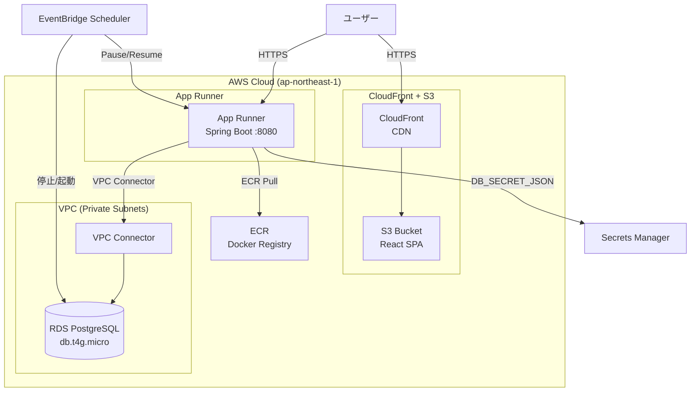
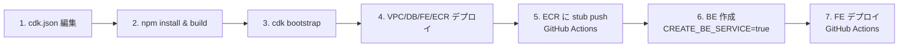

# infra 用リポジトリ

AWS CDK でアプリケーション基盤を構築するためのリポジトリです。  
リポジトリを複製して `cdk.json` を編集するだけで、同様の環境を構築できます。

---

## アーキテクチャ



### 作成されるリソース一覧

| スタック | リソース | 概算月額費用 (東京) |
|---------|---------|-------------------|
| `vpc` | VPC, Private Subnets x2, Security Groups | 無料 |
| `db` | RDS PostgreSQL (db.t4g.micro, 20GB gp3) | ~$15 |
| `fe` | S3 + CloudFront | ~$1 (低トラフィック時) |
| `ecr` | ECR リポジトリ | ~$0 (少量保存時) |
| `be` | App Runner (0.25vCPU, 0.5GB) | ~$5 (pause時は課金なし) |
| `schedule` | EventBridge Scheduler | 無料 |

> 夜間停止スケジュールを有効にすると、DB + App Runner のコストをさらに抑制できます。

---

## 初期設定（やることは1つ: `cdk.json` を編集）

すべての設定値は `/cdk.json` の `context` に集約されています。  
**コードの書き換えは不要です。** `cdk.json` を編集するだけで動きます。

```jsonc
// cdk.json
{
  "app": "node dist/bin/app.js",
  "context": {
    "APP_NAME": "my-app",              // ← サービス名に変更（必須）
    "VPC_CIDR": "10.110.0.0/24",      // ← 他チームと被らないCIDRを指定
    "CREATE_BE_SERVICE": "false",      // ← BE作成時に "true" に変更
    "ENABLE_SCHEDULE": "false",        // ← 夜間停止を有効にするなら "true"
    "SCHEDULE_WEEKDAYS_ONLY": "false", // ← 土日終日停止するなら "true"
    "DB_BACKUP_RETENTION_DAYS": "1"    // ← バックアップ保持日数
  }
}
```

### VPC CIDR の選び方

他チームの VPC と CIDR が重複するとピアリング等で問題になります。  
以下のコマンドで既存の VPC 一覧を確認してから、被らない範囲を選んでください。

```bash
aws ec2 describe-vpcs --query "Vpcs[].{Id:VpcId, CIDR:CidrBlock, Name:Tags[?Key=='Name']|[0].Value}" --output table
```

**選び方の例:**  
`10.110.0.0/24`, `10.110.1.0/24`, `10.110.2.0/24` ... のように /24 単位でずらす。

### (任意) package.json のサービス名変更

```json
{
  "name": "<サービス名>-infra",
  "bin": { "<サービス名>": "bin/app.js" }
}
```

---

## デプロイ手順

### 前提条件

- Node.js 20+ / npm
- AWS CLI v2 (`aws configure` で認証済み)
- CDK CLI (`npm i -g aws-cdk`)

### 手順概要（初回フロー図）



### 1. セットアップ

```bash
npm install
npm run build
```

### 2. CDK ブートストラップ（初回のみ）

```bash
cdk bootstrap aws://<AWS_ACCOUNT_ID>/ap-northeast-1
```

### 3. スタック名を確認

```bash
cdk ls
# 出力例:
# my-app-vpc
# my-app-db
# my-app-fe
# my-app-ecr
# my-app-be
# my-app-schedule
```

### 4. VPC / DB / FE / ECR をデプロイ

```bash
cdk deploy my-app-vpc my-app-db my-app-fe my-app-ecr --require-approval never
```

<details>
<summary>✅ 成功確認</summary>

```bash
# VPC が作られたか確認
aws ec2 describe-vpcs --filters "Name=tag:Name,Values=my-app-vpc" --query "Vpcs[0].VpcId"

# DB エンドポイントを確認
aws cloudformation describe-stacks --stack-name my-app-db \
  --query "Stacks[0].Outputs[?OutputKey=='DbEndpoint'].OutputValue" --output text

# CloudFront URL を確認（まだ中身は空）
aws cloudformation describe-stacks --stack-name my-app-fe \
  --query "Stacks[0].Outputs[?OutputKey=='CloudFrontUrl'].OutputValue" --output text

# ECR リポジトリ URI を確認
aws cloudformation describe-stacks --stack-name my-app-ecr \
  --query "Stacks[0].Outputs[?OutputKey=='EcrRepoUri'].OutputValue" --output text
```

</details>

### 5. ECR に Docker イメージを push

アプリケーション用リポジトリ（ALAB-app-Sample-Template）の GitHub Actions で実行します。

- Spring Boot 未作成の場合: `dockerfile=stub` で実行
- Spring Boot 作成済みの場合: `dockerfile=gradle` で実行

### 6. Backend（App Runner）を作成

`cdk.json` で `"CREATE_BE_SERVICE": "true"` に変更してからデプロイ:

```bash
npm run build
cdk deploy my-app-be --require-approval never
```

<details>
<summary>✅ 成功確認</summary>

```bash
# App Runner URL を確認（ブラウザでアクセス可能）
aws cloudformation describe-stacks --stack-name my-app-be \
  --query "Stacks[0].Outputs[?OutputKey=='AppRunnerServiceUrl'].OutputValue" --output text
```

表示された URL にブラウザでアクセスし、レスポンスが返ればOK。  
stub の場合は "Hello from stub" が表示されます。

</details>

### 7. Frontend をデプロイ

アプリリポの GitHub Actions「Build & Deploy Frontend to S3/CloudFront」を手動実行します。

<details>
<summary>✅ 成功確認</summary>

手順4で確認した CloudFront URL にブラウザでアクセスし、React アプリが表示されればOK。

</details>

### 8. (任意) 夜間停止スケジュール

`cdk.json` で `"ENABLE_SCHEDULE": "true"` に変更してからデプロイ:

```bash
npm run build
cdk deploy my-app-schedule --require-approval never
```

- 20:00 JST に RDS 停止 & App Runner Pause
- 08:00 JST に RDS 起動 & App Runner Resume
- `"SCHEDULE_WEEKDAYS_ONLY": "true"` にすると、起動が月〜金のみ（土日は終日停止）

---

## コピペ用（初回セットアップ一式）

```bash
# 0) cdk.json の APP_NAME を編集済みであること！
npm install
npm run build

# 1) ブートストラップ
cdk bootstrap aws://<AWS_ACCOUNT_ID>/ap-northeast-1

# 2) VPC/DB/FE/ECR（BEはまだ作らない）
cdk deploy my-app-vpc my-app-db my-app-fe my-app-ecr --require-approval never

# 3) GitHub Actions で ECR に stub を push 後 ...
#    cdk.json で CREATE_BE_SERVICE を "true" に変更してから:
npm run build
cdk deploy my-app-be --require-approval never

# 4) 夜間停止（任意）- cdk.json で ENABLE_SCHEDULE を "true" に変更してから:
npm run build
cdk deploy my-app-schedule --require-approval never
```

> ⚠️ `my-app` 部分は `cdk.json` の `APP_NAME` に合わせて読み替えてください。

---

## リソースの削除

```bash
cdk destroy --all
```

> RDS は `deletionProtection: false` / `removalPolicy: DESTROY` のため、`cdk destroy` で完全に削除されます。本番環境では設定を変更してください。

---

## トラブルシューティング

| 症状 | 原因 | 対処 |
|------|------|------|
| `cdk bootstrap` で AccessDenied | AWS CLI の認証情報が無い or 権限不足 | `aws sts get-caller-identity` で確認。管理者に権限付与を依頼 |
| `cdk deploy` で "Resource already exists" | 同名リソースが既に存在 | `APP_NAME` を別名に変更するか、既存リソースを削除 |
| App Runner が "Health check failed" | アプリが 8080 で起動していない | ECR のイメージが正しいか確認。stub なら正常に動くはず |
| App Runner が DB に接続できない | Security Group / Subnet の問題 | VPC スタックが正しくデプロイされているか確認 |
| `cdk deploy` で "No export named..." | スタック間の依存が壊れている | 依存元スタックから順に再デプロイ（vpc → db → be） |
| CloudFront で 403 エラー | S3 にファイルが無い | GitHub Actions で FE をデプロイ済みか確認 |
| GitHub Actions で "ECR repository not found" | infra の ECR スタック未デプロイ | 先に `cdk deploy my-app-ecr` を実行 |

---

## 参考リンク

- [AWS CDK 公式ドキュメント](https://docs.aws.amazon.com/cdk/v2/guide/home.html)
- [App Runner 開発者ガイド](https://docs.aws.amazon.com/apprunner/latest/dg/what-is-apprunner.html)
- [RDS PostgreSQL ドキュメント](https://docs.aws.amazon.com/AmazonRDS/latest/UserGuide/CHAP_PostgreSQL.html)
